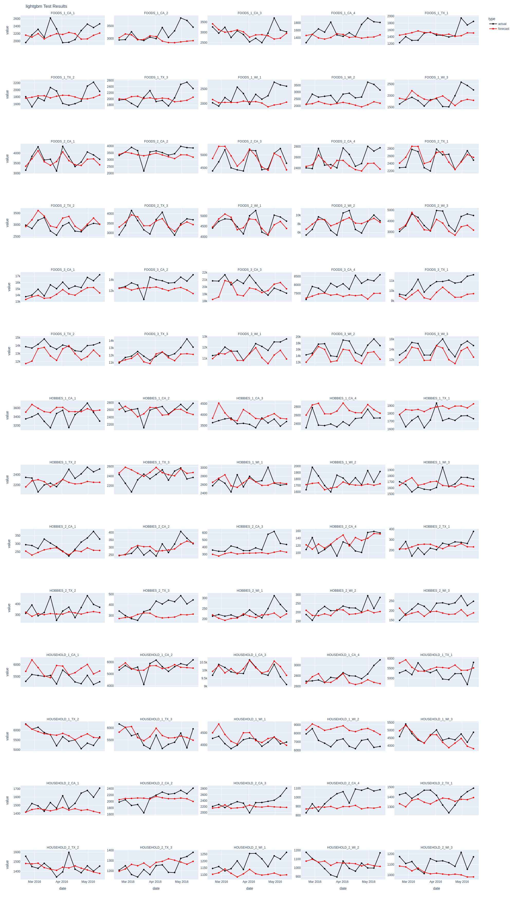

# Retail Demand Forecasting Pipeline

**An end-to-end system for automated model selection, hyperparameter optimization, and deployment across deep learning and machine learning architectures.**

[](https://www.python.org/)
[](https://pytorch.org/)
[](https://mlflow.org/)
[](LICENSE)

---

## Key Results

| Achievement | Value |
|-------------|-------|
| **Forecast Accuracy** | 8.35% SMAPE (91.65% accuracy) |
| **vs. Baseline** | 45% improvement over seasonal naïve |
| **Models Benchmarked** | 9 architectures (6 deep learning + 3 gradient boosting) |
| **Optimization** | 450 trials total (50 per model) via Bayesian optimization |
| **Pipeline Runtime** | ~2 hours end-to-end on GPU |

---

## Project Overview

The pipeline takes raw retail sales data and produces a tuned, tested forecasting model—no manual hyperparameter selection required. Run one command, get a production-ready model.

Here's what happens under the hood:

1. Ingests raw data and engineers temporal, price, and event features
2. Trains 9 models (6 deep learning + 3 gradient boosting) with Optuna hyperparameter optimization
3. Validates each model using walk-forward backtesting with time-series-appropriate splits
4. Picks the winner based on SMAPE
5. Retrains the winner on combined train+validation data
6. Evaluates on held-out test data
7. Saves the selected model for inference, optimal hyperparameters, and an interactive dashboard

---

## Business Context

This isn't just a modeling exercise—it's a decision problem. The pipeline delivers 4-week-ahead forecasts at the department × store level (70 time series), which matters for:

| Business Outcome | How Forecasts Help |
|------------------|-------------------|
| **Inventory Optimization** | Reduce overstock carrying costs and stockout losses |
| **Supply Chain Planning** | Department-level granularity supports procurement decisions |
| **Promotional Planning** | Price and event-aware models enable better timing |

---

## Results

The best model (LightGBM) achieved 8.35% SMAPE on validation and 9.75% on test—a 45% improvement over the seasonal naïve baseline.

| Rank | Model | Type | SMAPE | MASE | RMSSE | Training Time |
|:----:|-------|:----:|------:|-----:|------:|:-------------:|
| 1 | LightGBM | ML | 8.35% | 0.55 | 0.56 | ~2 min |
| 2 | XGBoost | ML | 8.38% | 0.55 | 0.55 | ~3 min |
| 3 | TiDE | DL | 9.28% | 0.62 | 0.62 | ~15 min |
| 4 | CatBoost | ML | 9.91% | 0.65 | 0.64 | ~5 min |
| 5 | N-BEATS | DL | 10.28% | 0.69 | 0.68 | ~20 min |
| 6 | LSTM | DL | 11.19% | 0.83 | 0.81 | ~12 min |
| 7 | GRU | DL | 11.49% | 0.85 | 0.81 | ~10 min |
| 8 | TFT | DL | 11.75% | 0.86 | 0.82 | ~25 min |
| 9 | TCN | DL | 67.94% | 3.08 | 2.53 | ~8 min |

**Reading the metrics:** MASE below 1.0 means the model beats the seasonal naïve baseline (predicting same-week-last-year). TCN underperformed significantly—likely because it doesn't utilize static covariates.

### Validation vs. Test Performance

| Metric | Validation | Test | Delta |
|--------|------------|------|-------|
| SMAPE | 8.35% | 9.75% | +1.4pp |
| MASE | 0.55 | 0.63 | +0.08 |
| RMSSE | 0.56 | 0.60 | +0.04 |


The test set performance was slightly worse than validation, which is expected. The gap is small enough to suggest the model generalizes reasonably well.

---

## Interactive Dashboard

The pipeline generates an interactive Plotly dashboard where users can compare forecasts across all models and department-store combinations:


---

## Why Gradient Boosting Beat Deep Learning

I expected TFT or TiDE to win. They didn't. Here's why:

**Not enough data.** With 70 time series × 277 weeks, we're looking at roughly 19K samples. Deep learning models typically need more data to outperform well-tuned gradient boosting on tabular problems.

**Strong hand-crafted features.** The lag features (especially lag-52 for yearly seasonality) and target-encoded events give tree models most of what they need. Deep learning's advantage is learning features automatically—but if you've already engineered good ones, that advantage shrinks.

**Hyperparameter sensitivity.** Deep learning models have more knobs to tune. 50 Optuna trials might not be enough to find good configurations, especially for TFT which has many architectural hyperparameters.

This isn't a failure of deep learning—it's that for medium-scale retail forecasting with solid feature engineering, gradient boosting was the right tool.

---

## Why These Metrics?

| Metric | What It Measures | Why I Chose It |
|--------|------------------|----------------|
| **SMAPE** | Symmetric percentage error | Scale-independent; "8.35% error" is intuitive for stakeholders |
| **MASE** | Error relative to seasonal naïve | Gold standard for time series; <1.0 = beats baseline |
| **RMSSE** | Scaled RMSE (M5 competition metric) | Penalizes large errors; enables comparison with published benchmarks |

SMAPE is the primary selection metric because business stakeholders understand percentages more intuitively than abstract ratios.

---

## Architecture

```
┌─────────────────────────────────────────────────────────────────────────────┐
│                              PIPELINE FLOW                                  │
│                  Single Command: python -m src.forecasting.pipeline         │
├─────────────────────────────────────────────────────────────────────────────┤
│                                                                             │
│  ┌────────────────┐    ┌────────────────┐    ┌────────────────┐             │
│  │   Raw Data     │───▶│    Feature     │───▶│  Temporal Split │           │
│  │   Ingestion    │    │  Engineering   │    │  Train/Val/Test │            │
│  │                │    │                │    │   70/15/15%     │            │
│  └────────────────┘    └────────────────┘    └───────┬────────┘             │
│                                                       │                     │
│         ┌─────────────────────────────────────────────┴──────────────┐      │
│         ▼                                                            ▼      │
│  ┌──────────────────────┐                        ┌──────────────────────┐   │
│  │   Deep Learning      │                        │   Gradient Boosting  │   │
│  │   ────────────────   │                        │   ────────────────── │   │
│  │   • TFT (Attention)  │                        │   • LightGBM         │   │
│  │   • TiDE (MLP-based) │                        │   • XGBoost          │   │
│  │   • N-BEATS          │                        │   • CatBoost         │   │
│  │   • TCN, LSTM, GRU   │                        │                      │   │
│  └──────────┬───────────┘                        └──────────┬───────────┘   │
│             │                                                │              │
│             └──────────────────────┬─────────────────────────┘              │
│                                    ▼                                        │
│            ┌───────────────────────────────────────────────────┐            │
│            │        Optuna Hyperparameter Optimization         │            │
│            │        ──────────────────────────────────         │            │
│            │        • 50 trials per model (Bayesian TPE)       │            │
│            │        • Early stopping for Deep Learning models  │            │
│            │        • YAML-configured search spaces            │            │
│            └───────────────────────┬───────────────────────────┘            │
│                                    ▼                                        │
│            ┌───────────────────────────────────────────────────┐            │
│            │         Walk-Forward Backtesting                  │            │
│            │         ─────────────────────────                 │            │
│            │         • 4-week rolling forecasts                │            │
│            │         • Temporal cross-validation               │            │
│            │         • SMAPE/MASE/RMSSE evaluation             │            │
│            └───────────────────────┬───────────────────────────┘            │
│                                    ▼                                        │
│            ┌───────────────────────────────────────────────────┐            │
│            │         Automated Model Selection                 │            │
│            │         ──────────────────────────                │            │
│            │         • Rank by primary metric (SMAPE)          │            │
│            │         • Retrain winner on train+val data        │            │
│            │         • Generate test set predictions           │            │
│            └───────────────────────┬───────────────────────────┘            │
│                                    ▼                                        │
│            ┌───────────────────────────────────────────────────┐            │
│            │         Production Artifacts                      │            │
│            │         ────────────────────                      │            │
│            │         • Serialized model (.pkl)                 │            │
│            │         • Hyperparameters (JSON)                  │            │
│            │         • MLflow experiment logs                  │            │
│            │         • Interactive dashboards (HTML)           │            │
│            └───────────────────────────────────────────────────┘            │
│                                                                             │
└─────────────────────────────────────────────────────────────────────────────┘
```

All models train globally (one model across 70 series) rather than locally. With only 277 weeks per series, global training lets the model learn shared patterns like holiday effects.

---

## Models

### Deep Learning (PyTorch + Darts)

| Model | Architecture | Key Strength | Covariate Support |
|-------|--------------|--------------|-------------------|
| TFT | Temporal Fusion Transformer | Interpretable attention weights | Future + Static |
| TiDE | MLP-based encoder-decoder | Fast training, competitive accuracy | Future + Static |
| N-BEATS | Basis expansion | Purely univariate, no feature engineering needed | None |
| TCN | Temporal convolutional network | Parallel computation, long receptive field | Past only |
| LSTM | Recurrent (gated memory) | Sequential pattern learning | Future only |
| GRU | Simplified LSTM | Fewer parameters, faster training | Future only |

### Gradient Boosting

| Model | Framework | Key Strength | Covariate Support |
|-------|-----------|--------------|-------------------|
| LightGBM | Microsoft | Histogram-based, very fast | Future + Static |
| XGBoost | DMLC | Well-regularized, robust | Future + Static |
| CatBoost | Yandex | Native categorical handling | Future + Static |

---

## Features

| Type | Features | Encoding | Why It Matters |
|------|----------|----------|----------------|
| Calendar | Week-of-year, month | Sin/cos cyclical | Week 52 stays close to week 1 |
| Events | Holidays, SNAP days | Target encoding | Captures event-specific demand lift |
| Price | Weekly sell price | Direct (future covariate) | Known in advance for planning |
| Hierarchy | Department, Store IDs | Static covariates | Enables cross-series pattern learning |
| Lags | Lag 1-4, lag 52 | Past covariates | Lag-52 is critical for retail seasonality |

---

## Project Structure

```
├── config/
│   ├── data.yaml                    # Data paths, feature definitions, forecast horizon
│   └── models.yaml                  # Hyperparameter search spaces
│
├── src/forecasting/
│   ├── pipeline.py                  # Main entry point
│   ├── raw_data_processing.py       # ETL: ingestion, cleaning, feature engineering
│   ├── model_data.py                # Darts TimeSeries construction + train/val/test split
│   ├── models.py                    # Model factory
│   ├── model_tuning.py              # Optuna optimization
│   ├── model_implementation.py      # Training, backtesting, and inference
│   └── experiment_tracking.py       # MLflow integration
│
├── output/
│   ├── model/
│   │   ├── selected_model_*.pkl     # Saved model
│   │   └── *_best_params.json       # Optimized hyperparameters per model
│   ├── tuned_models_backtest_performance.csv
│   ├── best_model_test_performance.csv
│   ├── backtest_results_interactive.html
│   └── selected_model_test_results.png
│
├── mlruns/                          # MLflow experiment tracking artifacts
├── requirements.txt
└── README.md
```

---

## Output Artifacts

| Artifact | Description | Use Case |
|----------|-------------|----------|
| `selected_model_*.pkl` | Serialized best model | Production inference |
| `*_best_params.json` | Optimized hyperparameters | Model documentation, retraining |
| `tuned_models_backtest_performance.csv` | All 9 models' metrics | Model comparison analysis |
| `best_model_test_performance.csv` | Hold-out evaluation | Performance reporting |
| `backtest_results_interactive.html` | Plotly dashboard | Stakeholder communication |
| `mlruns/` | Full experiment history | Reproducibility, audit trail |

### Final Model Test Predictions

Test set predictions from the automatically selected best model (LightGBM) across all 70 department-store time series:



---

## Technical Skills Demonstrated

| Area | Skills |
|------|--------|
| **ML System Design** | End-to-end pipeline, automated model selection, production deployment |
| **Time Series** | Global modeling, walk-forward validation, multi-horizon forecasting, covariate engineering |
| **Deep Learning** | PyTorch, Transformers (TFT), sequence models (LSTM/GRU), temporal CNNs |
| **Gradient Boosting** | LightGBM, XGBoost, CatBoost with time-series feature engineering |
| **Hyperparameter Optimization** | Bayesian optimization (Optuna TPE), early stopping, search space design |
| **MLOps** | Experiment tracking (MLflow), reproducible pipelines, model serialization |
| **Software Engineering** | Modular architecture, factory patterns, YAML configuration |

---

## What I'd Do Next

A few things I'd add if taking this to production:

- **Cost-weighted loss functions** — Stockouts and overstock have different costs; the model should reflect that
- **Probabilistic forecasts** — Point forecasts are useful, but prediction intervals help with safety stock calculations
- **Hierarchical reconciliation** — Make sure store-level and department-level forecasts add up correctly
- **Drift detection** — Trigger retraining when the data distribution shifts
- **SHAP values** — Help explain why the model made specific predictions

---

## Tech Stack

| Category | Technologies |
|----------|--------------|
| **ML/DL** | PyTorch 2.2, PyTorch Lightning, Darts, scikit-learn |
| **Gradient Boosting** | LightGBM, XGBoost, CatBoost |
| **Optimization** | Optuna (TPE sampler, pruning) |
| **Tracking** | MLflow |
| **Visualization** | Plotly, Matplotlib |
| **Data** | Pandas, NumPy |

---

## References

- [M5 Forecasting Competition](https://www.kaggle.com/c/m5-forecasting-accuracy)
- [Darts Documentation](https://unit8co.github.io/darts/)
- [Temporal Fusion Transformers (Lim et al., 2021)](https://arxiv.org/abs/1912.09363)
- [N-BEATS (Oreshkin et al., 2019)](https://arxiv.org/abs/1905.10437)

---

## Author

Yedan Zhang — [GitHub](https://github.com/yedanzhang-ai) | [LinkedIn](https://linkedin.com/in/yedanzhang)
